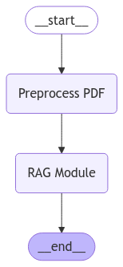

# PDF Query Using LangGraph and Google Generative AI
This Streamlit app utilizes LangChain, Google Generative AI, and LangGraph to allow users to upload a PDF and ask questions based on the content of the PDF. The app performs the following steps:
- Extracts text from the uploaded PDF.
- Splits the text into manageable chunks for embedding.
- Generates embeddings using Google Generative AI.
- Indexes the embeddings using FAISS (a popular vector database).
- Uses a retrieval-based model (RAG) to answer questions based on the PDF content.

### Graph Integration:

- LangGraph is used to define a graph of the process flow.
- The "Preprocess PDF" node handles text extraction and embedding.
- The "RAG Module" node handles querying the vector store and generating an answer.
- The graph is compiled, and the app invokes it with user input to return the answer.

### 💡 Usage
**Upload a PDF:**
Use the file uploader to upload a PDF document containing the information you want to process.

**Process the PDF:**
The app extracts and chunks the text from the PDF.
Embeddings for the text chunks are generated using Google Generative AI.
These embeddings are indexed in a FAISS vector database.

**Ask Questions:**
Type a question related to the content of the PDF in the text input box.
The system retrieves relevant content and generates an answer using Google Generative AI.

**View Results:**
Click "Answer" to receive a response generated by the Google Generative AI model based on the contents of the uploaded PDF.

### 🤝 Contributions
Contributions are welcome! Feel free to open issues or submit pull requests to enhance the functionality or address any bugs.