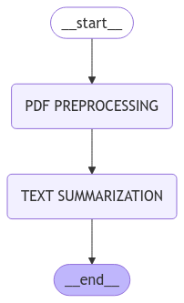

# PDF Summarization with LangGraph and Google Generative AI
This Streamlit application uses LangChain, LangGraph, and Google Generative AI to allow users to upload a PDF file and receive a summary of its content. The app leverages Google’s generative model for text summarization and organizes the workflow with LangGraph.

### 🚀 Features
- **PDF Text Extraction:** Extracts text from uploaded PDF files using PyPDF2.
- **Text Summarization:** Uses Google Generative AI to summarize the extracted text, focusing on key features and organizing content by headings and sub-headings.
- **LangGraph Workflow:** The app defines a workflow for PDF processing and summarization using LangGraph, which orchestrates the flow between different nodes in the process.

### Live Demo
You can access the live Streamlit application at the following link: [PDF Summarization with LangGraph and Google Generative AI](https://ragmodels-langgraph-pdf-summarization.streamlit.app/)

### Graph Integration:

- LangGraph is used to define a graph of the process flow.
- The "Preprocess PDF" node handles text extraction and embedding.
- The "Text Summarization" node processes the text and generates the summary.
- The graph is compiled, and the app invokes the pdf file as an input to return the answer.

### 💡 Usage
**Upload a PDF:**
Use the file uploader to upload a PDF document containing the information you want to process.

**Process the PDF:**
The app extracts and chunks the text from the PDF.

**Text Summarization:**
The system retrieves relevant content and generates a summary of the PDF content, organized by headings and subheadings using Google Generative AI.

**View Results:**
Click "Answer" to receive a summary generated by the model based on the contents of the uploaded PDF.

### 🤝 Contributions
Contributions are welcome! Feel free to open issues or submit pull requests to enhance the functionality or address any bugs.